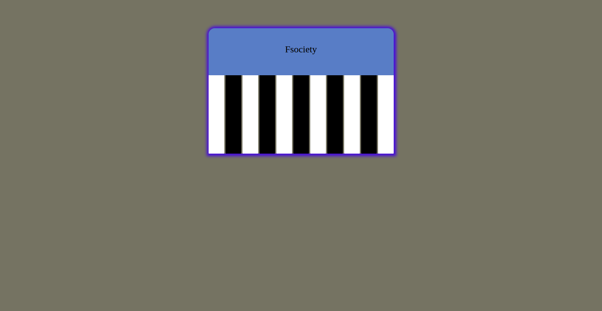

# Piano — Fsociety 🎹🇦🇱

Krijimi i një pianoje vetëm me HTML dhe CSS është një sfidë emocionuese që përfshin përdorimin e aftësive të zhvillimit web për të krijuar diçka vizualisht tërheqëse.

**🔴 Demo live:** https://erionnezha.github.io/gameproject/

## ▶️ Ekzekuto lokalisht

Hap `piano.html` në çdo shfletues.

## 📄 Licenca

Copyright © 2026 Erion Nezha. Të gjitha të drejtat e rezervuara.

---

# Piano — Fsociety 🎹🇬🇧

Creating a piano with just HTML and CSS is an exciting challenge that involves using web development skills to create something visually appealing.

**🔴 Live demo:** https://erionnezha.github.io/gameproject/

## ▶️ Run locally

Open `piano.html` in any browser.

## 📄 License

Copyright © 2026 Erion Nezha. All rights reserved.
